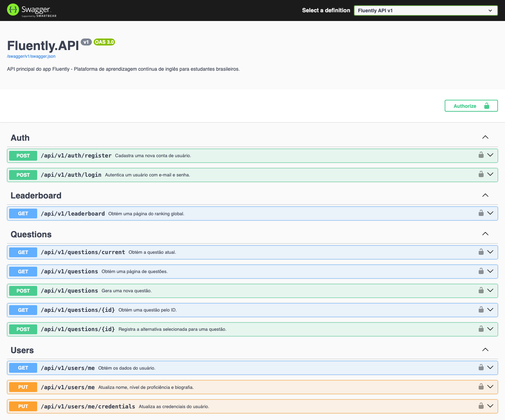

# API do Fluently

[← Voltar para o README principal](../README.md)

API REST usada pelo aplicativo Fluently, desenvolvida com ASP.NET Core 10.

## URLs base

| Ambiente | URL |
| --- | --- |
| HTTP local | http://localhost:5229 |
| HTTPS local | https://localhost:7042 |
| Docker | http://localhost:8080 |

## Swagger

Disponível quando ASPNETCORE_ENVIRONMENT=Development:

~~~text
http://localhost:5229/swagger
http://localhost:5229/swagger/v1/swagger.json
~~~

Para testar rotas protegidas, clique em **Authorize** e informe Bearer SEU_TOKEN_DE_ACESSO.

## Autenticação

Cadastro e login são públicos. As demais rotas exigem:

~~~http
Authorization: Bearer <token-de-acesso>
~~~

## Endpoints

| Método | Rota | Auth | Descrição |
| --- | --- | --- | --- |
| POST | /api/v1/auth/register | Não | Criar conta |
| POST | /api/v1/auth/login | Não | Fazer login |
| GET | /api/v1/users/me | Sim | Consultar perfil |
| PUT | /api/v1/users/me | Sim | Atualizar perfil |
| PUT | /api/v1/users/me/credentials | Sim | Atualizar credenciais |
| GET | /api/v1/questions/current | Sim | Consultar questão pendente |
| GET | /api/v1/questions | Sim | Consultar histórico |
| GET | /api/v1/questions/{id} | Sim | Consultar questão |
| POST | /api/v1/questions | Sim | Gerar questão com IA |
| POST | /api/v1/questions/{id} | Sim | Enviar resposta |
| GET | /api/v1/leaderboard | Sim | Consultar ranking |
| GET | /health/live | Não | Verificar processo |
| GET | /health/ready | Não | Verificar dependências |

## Erros

Os erros usam application/problem+json:

~~~json
{
  "title": "Unauthorized",
  "status": 401,
  "detail": "A autenticação é obrigatória para acessar este recurso.",
  "instance": "/api/v1/questions/current",
  "traceId": "00-00000000000000000000000000000000-0000000000000000-00"
}
~~~

Erros de validação também possuem errors:

~~~json
{
  "title": "Bad Request",
  "status": 400,
  "detail": "Corrija os campos informados e tente novamente.",
  "errors": {
    "Password": ["A senha deve conter pelo menos um número."]
  },
  "traceId": "00-00000000000000000000000000000000-0000000000000000-00"
}
~~~

## Autenticação

### Cadastro — POST /api/v1/auth/register

~~~json
{
  "firstName": "Ana",
  "lastName": "Oliveira",
  "email": "ana@example.com",
  "password": "Fluently1!",
  "passwordConfirmation": "Fluently1!"
}
~~~

Resposta 201 Created:

~~~json
{
  "id": "11111111-1111-1111-1111-111111111111",
  "firstName": "Ana",
  "lastName": "Oliveira",
  "email": "ana@example.com",
  "totalXp": 0,
  "currentStreak": 0,
  "proficiency": null,
  "bio": null,
  "profileImageBase64": null,
  "createdAt": "2026-09-16T12:00:00+00:00"
}
~~~

Senha: 8 a 128 caracteres, uma maiúscula, um número e um símbolo. Status: 201, 400, 409.

### Login — POST /api/v1/auth/login

~~~json
{
  "email": "ana@example.com",
  "password": "Fluently1!"
}
~~~

Resposta 200 OK:

~~~json
{
  "accessToken": "eyJhbGciOiJIUzI1NiIsInR5cCI6IkpXVCJ9...",
  "tokenType": "Bearer",
  "expiresAt": "2026-09-16T18:00:00+00:00",
  "user": {
    "id": "11111111-1111-1111-1111-111111111111",
    "firstName": "Ana",
    "lastName": "Oliveira",
    "email": "ana@example.com",
    "totalXp": 0,
    "currentStreak": 0,
    "proficiency": null,
    "bio": null,
    "profileImageBase64": null,
    "createdAt": "2026-09-16T12:00:00+00:00"
  }
}
~~~

Status: 200, 400, 401.

## Usuários

### Consultar perfil — GET /api/v1/users/me

Resposta 200 OK:

~~~json
{
  "id": "11111111-1111-1111-1111-111111111111",
  "firstName": "Ana",
  "lastName": "Oliveira",
  "email": "ana@example.com",
  "totalXp": 45,
  "currentStreak": 3,
  "proficiency": 3,
  "bio": "Gosto de música, tecnologia e viagens.",
  "profileImageBase64": null,
  "createdAt": "2026-09-16T12:00:00+00:00"
}
~~~

Status: 200, 401, 404.

### Atualizar perfil — PUT /api/v1/users/me

~~~json
{
  "firstName": "Ana",
  "lastName": "Oliveira",
  "proficiency": 3,
  "bio": "Gosto de música, tecnologia e viagens.",
  "profileImageBase64": "iVBORw0KGgoAAAANSUhEUgAA..."
}
~~~

Todos os campos são opcionais. Resposta 200 OK com a estrutura do perfil. Status: 200, 400, 401, 404.

### Atualizar credenciais — PUT /api/v1/users/me/credentials

~~~json
{
  "email": "novo-email@example.com",
  "password": "NovaSenha1!",
  "passwordConfirmation": "NovaSenha1!"
}
~~~

Resposta 204 No Content com corpo vazio. Status: 204, 400, 401, 404, 409.

## Questões

A geração usa proficiência e biografia como contexto. A resposta da IA é validada antes de ser salva: uma lacuna, cinco alternativas, índice correto e contexto ainda não usado.

### Consultar questão atual — GET /api/v1/questions/current

~~~json
{
  "id": "22222222-2222-2222-2222-222222222222",
  "context": "Ana está falando sobre sua viagem.",
  "question": "I ___ to London last year.",
  "alternatives": [
    { "index": 1, "text": "travel", "translation": "viajo" },
    { "index": 2, "text": "traveled", "translation": "viajei" },
    { "index": 3, "text": "travels", "translation": "viaja" },
    { "index": 4, "text": "traveling", "translation": "viajando" },
    { "index": 5, "text": "will travel", "translation": "viajarei" }
  ],
  "baseXp": 15,
  "createdAt": "2026-09-16T12:10:00+00:00"
}
~~~

Status: 200, 401, 404.

### Listar histórico — GET /api/v1/questions?Page=1&PageSize=10

~~~json
{
  "items": [],
  "page": 1,
  "pageSize": 10,
  "totalItems": 0,
  "totalPages": 0
}
~~~

Status: 200, 400, 401. Cada item contém os dados da questão e, quando respondido, seu resultado.

### Consultar por ID — GET /api/v1/questions/{id}

Resposta 200 OK:

~~~json
{
  "id": "22222222-2222-2222-2222-222222222222",
  "context": "Ana está falando sobre sua viagem.",
  "question": "I ___ to London last year.",
  "alternatives": [],
  "questionTranslation": "Eu viajei para Londres no ano passado.",
  "correctAlternative": null,
  "baseXp": 15,
  "submittedAlternativeIndex": null,
  "isCorrect": null,
  "awardedXp": null,
  "createdAt": "2026-09-16T12:10:00+00:00",
  "answeredAt": null
}
~~~

Retorna a questão com sua resposta, quando já respondida. Status: 200, 401, 404.

### Gerar questão — POST /api/v1/questions

Não há corpo. O perfil precisa ter proficiency e bio preenchidos. Retorna 201 Created com uma questão pendente no formato da consulta atual.

Exemplo de resposta 201 Created:

~~~json
{
  "id": "33333333-3333-3333-3333-333333333333",
  "context": "Ana está falando sobre sua viagem.",
  "question": "I ___ to London last year.",
  "alternatives": [],
  "baseXp": 15,
  "createdAt": "2026-09-16T12:12:00+00:00"
}
~~~

A API não permite uma segunda questão pendente. Status: 201, 400, 401, 409, 503.

### Enviar resposta — POST /api/v1/questions/{id}

Requisição:

~~~json
{ "alternativeIndex": 2 }
~~~

Resposta 201 Created:

~~~json
{
  "questionId": "22222222-2222-2222-2222-222222222222",
  "isCorrect": true,
  "awardedXp": 15,
  "totalXp": 45,
  "currentStreak": 3,
  "correctAlternative": {
    "index": 2,
    "text": "traveled",
    "translation": "viajei"
  },
  "questionTranslation": "Eu viajei para Londres no ano passado.",
  "answeredAt": "2026-09-16T12:11:00+00:00"
}
~~~

Status: 201, 400, 401, 404, 409.

## Ranking

### Consultar ranking — GET /api/v1/leaderboard?Page=1&PageSize=20

~~~json
{
  "items": [
    {
      "rank": 1,
      "userId": "11111111-1111-1111-1111-111111111111",
      "fullName": "Ana Oliveira",
      "profileImageBase64": null,
      "totalXp": 120
    }
  ],
  "page": 1,
  "pageSize": 20,
  "totalItems": 1,
  "totalPages": 1
}
~~~

Status: 200, 400, 401.

## Health checks

### Disponibilidade — GET /health/live

Verifica se o processo está em execução, sem testar dependências. Normalmente retorna 200 OK com Healthy.

### Prontidão — GET /health/ready

Verifica as dependências, incluindo PostgreSQL. Retorna 200 OK quando tudo está pronto ou 503 Service Unavailable quando algo está indisponível.

## Observações

Usuários e questões ficam no PostgreSQL via Entity Framework Core. As senhas são armazenadas como hash. A chave da OpenAI fica somente no servidor e nunca no aplicativo Flutter.
