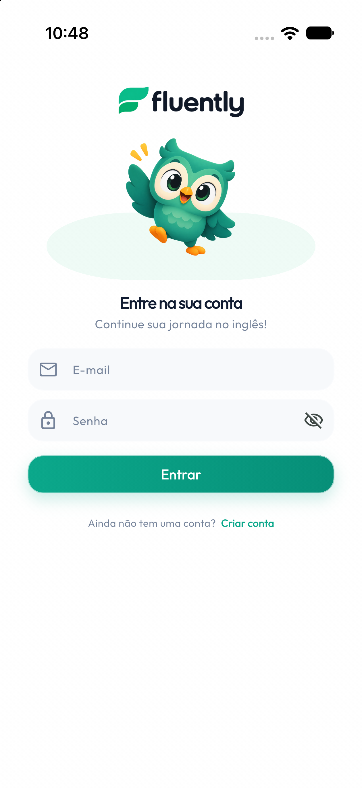
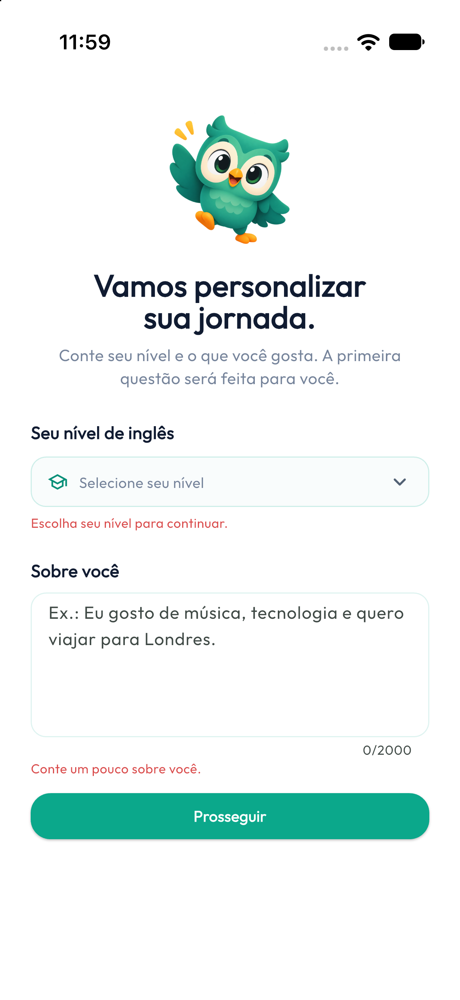
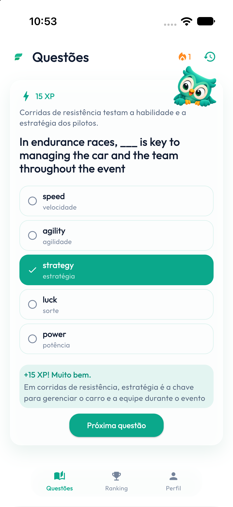
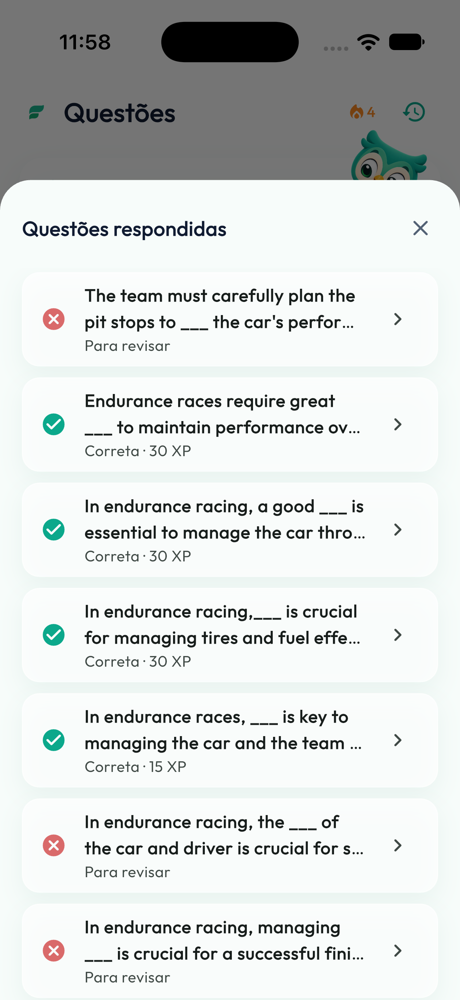
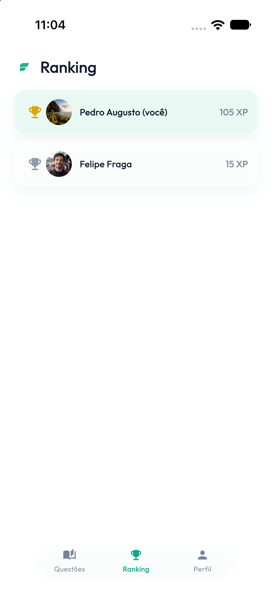
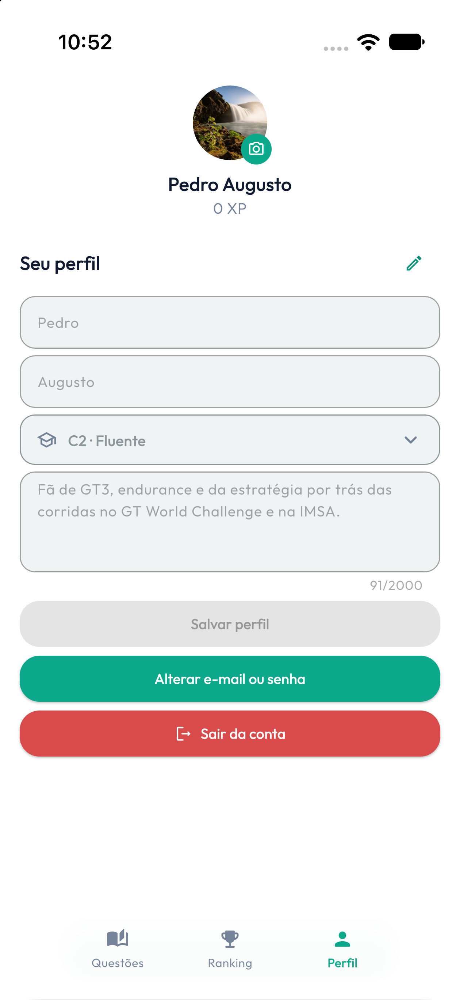
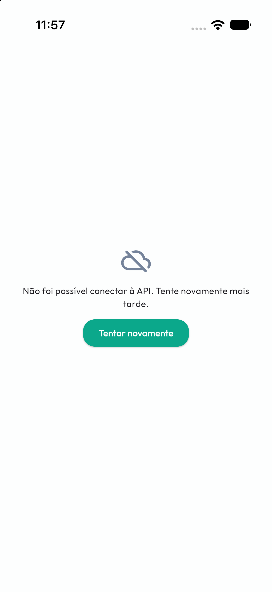

# Aplicativo mobile do Fluently

[Voltar](../README.md)

Aplicativo Flutter usado para login, onboarding, exercícios, progresso, histórico, ranking e edição do perfil.

## Telas principais

### Login e cadastro

A tela inicial permite fazer login. O cadastro pede nome, sobrenome, e-mail, senha e confirmação.

### Onboarding

Depois do cadastro, o estudante informa o nível de proficiência, de A1 a C2, e uma breve biografia com seus interesses. O fluxo só começa depois dessas informações.

### Questões

A aba principal mostra o contexto em português, a frase em inglês e cinco alternativas. Depois da resposta, mostra o resultado, a alternativa correta, a tradução, o XP e a sequência.

A API permite uma questão pendente por usuário. Depois de responder, o estudante pode solicitar a próxima.

### Histórico

O histórico usa paginação e permite abrir uma questão anterior para consultar a resposta e o resultado.

### Ranking

A aba de ranking mostra a classificação geral por XP, com posição, nome, imagem e pontuação.

### Perfil

A aba de perfil mostra nome, e-mail, XP, sequência, proficiência e biografia. Também permite editar os dados e escolher uma imagem pela câmera ou galeria.

## Fluxo de navegação

~~~text
Início
  |
  +-- token encontrado --> Tela principal
  |                         +-- Questões
  |                         +-- Ranking
  |                         +-- Perfil
  |
  +-- sem token ----------> Login -> Cadastro -> Onboarding -> Tela principal
~~~

## Organização do código

| Arquivo | Responsabilidade |
| --- | --- |
| lib/main.dart | Inicialização, tema, login e cadastro |
| lib/home_page.dart | Abas, onboarding, questões, histórico, ranking e perfil |
| lib/auth_api_client.dart | Login, cadastro e modelos |
| lib/fluently_api_client.dart | Chamadas autenticadas e modelos |
| lib/session_store.dart | Armazenamento seguro do token |
| assets/images/ | Mascote, ícone, logotipo e screenshots da documentação |

## Pacotes

| Pacote | Uso |
| --- | --- |
| http | Requisições HTTP |
| flutter_secure_storage | Armazenamento seguro do JWT |
| google_fonts | Fonte Outfit |
| image_picker | Câmera e galeria |
| flutter_launcher_icons | Ícones do aplicativo |

## Configuração

O endereço da API é passado por API_BASE_URL:

~~~bash
flutter pub get
flutter run --dart-define=API_BASE_URL=http://localhost:5229
~~~

Com Docker:

~~~bash
flutter run --dart-define=API_BASE_URL=http://localhost:8080
~~~

Em um celular físico, substitua localhost pelo IP do computador na rede local.

## Autenticação e sessão

Depois do login, o aplicativo salva o token no flutter_secure_storage. Ao iniciar, tenta recuperá-lo. Se a API retornar 401 Unauthorized, a sessão é apagada e o usuário volta ao login.

~~~http
Authorization: Bearer <token-de-acesso>
~~~

A chave da OpenAI nunca fica no aplicativo.

## Chamadas da API

| Funcionalidade | Chamada |
| --- | --- |
| Login | POST /api/v1/auth/login |
| Cadastro | POST /api/v1/auth/register |
| Perfil | GET /api/v1/users/me |
| Salvar perfil | PUT /api/v1/users/me |
| Questão atual | GET /api/v1/questions/current |
| Gerar questão | POST /api/v1/questions |
| Enviar resposta | POST /api/v1/questions/{id} |
| Histórico | GET /api/v1/questions?Page=1&PageSize=10 |
| Detalhes | GET /api/v1/questions/{id} |
| Ranking | GET /api/v1/leaderboard?Page=1&PageSize=20 |

As credenciais também podem ser alteradas em PUT /api/v1/users/me/credentials.

## Tratamento de erros

Os clientes Dart leem detail e errors. O aplicativo mostra mensagens temporárias para API indisponível, sessão expirada, campos inválidos, perfil incompleto e falhas da IA.

## Executando e compilando

~~~bash
flutter pub get
flutter analyze
flutter test
~~~

Para executar em um dispositivo:

~~~bash
flutter devices
flutter run --dart-define=API_BASE_URL=http://192.168.0.10:5229
~~~

Exemplos:

~~~bash
flutter build apk --release --dart-define=API_BASE_URL=https://sua-api.example.com
flutter build ios --release --dart-define=API_BASE_URL=https://sua-api.example.com
~~~
